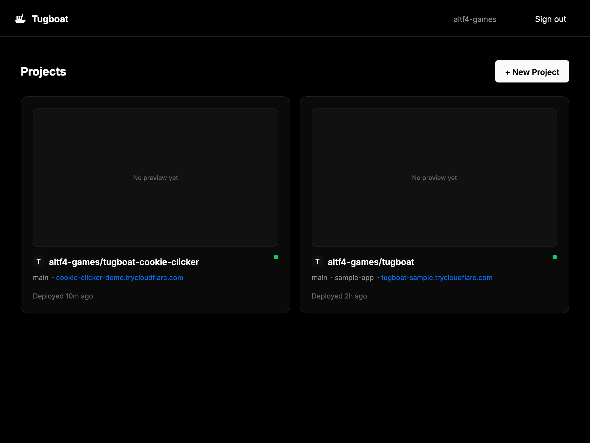
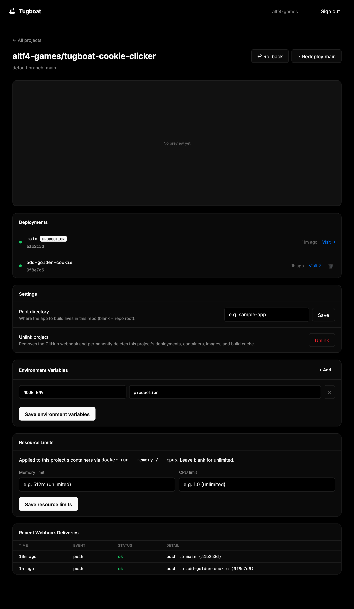

# Tugboat

A self-hosted, Vercel/Railway-style PaaS. Push a branch and it's built into a
container with no Dockerfile, given a live local URL and a real public HTTPS
link, and — on merge to `main` — zero-downtime promoted to a production
route with rollback support.

Built entirely from real open-source infrastructure, driven by a single
Node.js control plane:

```
push → build → route → promote → rollback
 │       │       │        │          │
 │       │       │        │          └─ re-point production at a previous image
 │       │       │        └─ blue-green swap with a real health check
 │       │       └─ Traefik auto-discovers the container, no config edits
 │       └─ Cloud Native Buildpacks (pack) turns the repo into an image
 └─ GitHub webhook, HMAC-verified
```

| Concern | Tool |
|---|---|
| Build | [Cloud Native Buildpacks](https://buildpacks.io/) (`pack` CLI, Paketo builders) |
| Container runtime | Docker (developed against [OrbStack](https://orbstack.dev/)) |
| Routing | [Traefik](https://traefik.io/) (Docker provider for previews, file provider for production) |
| Public links | [Cloudflare Tunnel](https://github.com/cloudflare/cloudflared) (`cloudflared` quick tunnels) |
| Storage | SQLite (`better-sqlite3`) for the deployment dashboard |

Every feature was built test-first against **real** infrastructure — a real
`pack build`, a real Docker daemon, a real Traefik instance, a real GitHub
webhook delivery, a real Cloudflare tunnel. Nothing is mocked and no data is
seeded.

## The web app

Beyond the pipeline itself, there's a real always-on control-plane server
with a Vercel-style UI: sign in with GitHub, pick a repo from your account,
click link — every push to that repo from then on gets built and deployed
automatically, shown live on a dashboard.

- **A landing page** when signed out, **sign in with GitHub** (real OAuth —
  redirects to github.com, you approve, you come back signed in and stay
  signed in — the session is stored in SQLite, so neither a page reload nor
  restarting the server logs you out)
- **Link a repo** from a searchable list of your actual GitHub repos, with an
  optional **root directory** for monorepos (the app to build doesn't have to
  live at the repo root — this repo itself is a real example: its buildable
  app is in `sample-app/`)
- Linking creates a **real webhook** on that repo, pointed at this server's
  own public tunnel
- Every push gets **a live build log** (streamed as it happens), then **a real
  public preview URL**
- Pushing to the repo's default branch **promotes to production** (blue-green,
  zero dropped requests) automatically
- **Deploy on demand** — a "Redeploy" button builds and ships the current
  `HEAD` of a branch without needing a new commit, the same way Vercel lets
  you trigger a build without pushing
- A project page lists its full deployment history (branch, commit, status,
  live/expandable logs, preview link) and lets you change the root directory
  or unlink the repo (which removes the webhook) after the fact

Run it with:

```bash
cd control-plane
npm start
```

then open **http://localhost:4000**. See [Setup](#setup) below for the
one-time GitHub OAuth App you need to register first (required for login;
everything else needs no configuration).

Unlike the test suite, this is meant to keep running: linking a repo creates
a real, persistent webhook on it, which stays until you unlink the repo
(from the UI) or delete it yourself from the repo's GitHub settings. Stopping
the server (`Ctrl+C`) cleanly tears down Traefik and its own tunnel, but
linked repos' webhooks are left in place on purpose — restart the server and
they keep working.

Want something to link and push to right away, instead of using one of your
own repos? [altf4-games/tugboat-cookie-clicker](https://github.com/altf4-games/tugboat-cookie-clicker)
is a small real React + Vite app (a cookie-clicker game) built specifically
as a Tugboat test target — link it, push a commit, watch it deploy.

<p align="center">
  
</p>

<p align="center">
  
</p>

<p align="center">
  
</p>

## Project structure

```
sample-app/       real minimal Express app — the subject that gets built and deployed
control-plane/    the orchestrator: webhook listener, build/route/promote/rollback logic, dashboard
  src/            one real capability per module (see table below)
  tests/          *.unit.test.js = pure logic, *.integration.test.js = real infra, no mocks
  docker/         nginx config used to work around a real Traefik/OrbStack API-version bug
scripts/          reserved for standalone CLI wrappers (currently unused — promote/rollback
                  are plain importable functions in control-plane/src/)
```

### What each module does

| Module | Responsibility |
|---|---|
| `hmac.js` / `pushEvent.js` / `deleteEvent.js` | Verify and parse real GitHub webhook payloads |
| `webhookServer.js` | Express endpoint wiring signature verification to push/delete handlers |
| `buildImage.js` / `buildWithLogging.js` | Shell out to `pack build`, optionally streaming live logs |
| `onPushBuild.js` | Connects a verified push to a real build, without blocking the webhook response |
| `dockerLabels.js` / `runAppContainer.js` | Traefik-labelled preview containers, one per branch |
| `traefikController.js` | Starts Traefik (Docker provider + file provider) with an OrbStack API-version workaround |
| `productionRoute.js` / `promote.js` | Blue-green production swap via Traefik's file provider |
| `rollback.js` / `deploymentHistory.js` | Re-promote a previous image from real promotion history |
| `tunnelManager.js` / `cloudflaredUrl.js` | Spawn a `cloudflared` tunnel, parse its real assigned URL |
| `previewRegistry.js` / `onDeleteTeardown.js` | Tear down a branch's container, route, and tunnel on delete |
| `resourceLimits.js` | Translate memory/CPU quotas into real `docker run` flags |
| `db.js` | SQLite-backed deployment + linked-project history |
| `dashboardServer.js` | Standalone build-log-streaming API, proven by its own test (superseded by `server.js` for the real app) |
| `session.js` / `githubOAuth.js` | Signed cookie sessions and the real GitHub OAuth login flow |
| `cloneRepo.js` | Clones a linked repo at the exact pushed commit (with token auth for private repos) |
| `multiProjectWebhook.js` | Routes an incoming webhook to the right linked project by its own secret |
| `projectPipeline.js` | The real wiring: push → clone → build → route → tunnel → (promote if default branch) |
| `server.js` | The actual app — starts Traefik, opens its own tunnel for GitHub to reach it, serves the UI and API |
| `public/index.html` | The dashboard UI (vanilla JS, no build step) |

## Prerequisites

Developed and tested on macOS (Apple Silicon, OrbStack). You need:

```bash
brew install --cask docker            # or use OrbStack — anything that provides a working `docker` CLI
brew install buildpacks/tap/pack      # Cloud Native Buildpacks CLI
brew install cloudflare/cloudflare/cloudflared
brew install node                     # Node 20+
```

Plus:

- **Docker running** (`docker info` should succeed) before doing anything else.
- **GitHub CLI authenticated** with `repo` scope (`gh auth login`) — the
  integration tests create and delete a real webhook and push/delete real
  throwaway branches on this repo's `origin` remote.
- A `git remote origin` pointing at a real GitHub repo you can push to (the
  webhook/tunnel/teardown tests derive the repo name from it).

No Traefik install needed — it runs as a container, pulled automatically.

## Setup

```bash
cd sample-app && npm install
cd ../control-plane && npm install
```

The **test suite** needs no config — it creates its own throwaway secrets,
ports, and container/branch names at runtime.

The **web app** (`npm start`) needs one thing: a GitHub OAuth App, since
that's the one piece GitHub doesn't expose an API for — it has to be created
by hand, once:

1. Go to <https://github.com/settings/developers> → OAuth Apps → New OAuth App
2. Application name: anything (e.g. "Tugboat (local dev)")
3. Homepage URL: `http://localhost:4000`
4. Authorization callback URL: `http://localhost:4000/auth/callback`
5. Register, then generate a client secret
6. Copy `control-plane/.env.example` to `control-plane/.env` and fill in:

   ```bash
   GITHUB_CLIENT_ID=<from the app you just created>
   GITHUB_CLIENT_SECRET=<the secret you just generated>
   SESSION_SECRET=<any random string — the .env.example comment shows how to generate one>
   ```

`control-plane/.env` is git-ignored — the secret never leaves your machine.

## How to test this yourself

Run the full suite from `control-plane/`:

```bash
cd control-plane
npm test
```

This is the real, meaningful way to verify the whole system — it doesn't
just check logic, it actually stands up the infrastructure and proves it
works:

- runs a **real** `pack build` against `sample-app/`
- registers a **real** webhook on your GitHub repo, fires a **real** push
  through a **real** `cloudflared` tunnel, and asserts your control plane
  received and parsed it correctly
- starts a **real** Traefik container and proves it auto-routes a freshly
  started container with zero config edits and zero restarts
- gets a **real** public `https://*.trycloudflare.com` link and hits it
  over the real internet
- runs a **real continuous HTTP load** across two production promotes and
  asserts **zero dropped requests**
- rolls back and confirms (via `docker inspect`, not a mock) that the
  previous image's container is genuinely running again
- streams **real** `pack build` output live over Server-Sent Events while
  the build is still in progress
- pushes then deletes a real branch and confirms the container, Traefik
  route, and tunnel are all actually gone
- gives a container a 20MB memory limit, deliberately exceeds it, and
  confirms Docker's real OOM killer actually killed it
- clones this repo for real, authenticated with a real access token, and
  checks out the exact pushed commit
- proves the multi-project webhook router accepts a project's own signed
  request and rejects one signed with a different project's secret

The interactive OAuth login itself (the actual "click Authorize on
github.com" step) isn't part of the automated suite — that's a human
granting consent, which is what OAuth is *for*; scripting around it isn't
appropriate. Everything downstream of getting a token (webhook creation,
cloning, building, deploying) is exercised for real by the suite above.

Expect this to take **several minutes** (multiple real `pack build`s, real
container startups, real network round-trips to GitHub and Cloudflare) —
that's the cost of testing against real infrastructure instead of mocks.

### Side effects you should know about

The integration tests are self-cleaning, but while running they will, for
real, against your `origin` GitHub repo:

- create and delete a webhook (events: `push`, `delete`)
- push and delete a handful of `webhook-test/*`, `build-test/*`,
  `teardown-test/*` branches
- pull several public Docker images (`traefik`, `nginx:alpine`,
  `node:20-alpine`) and build/run/remove a number of local containers

Everything is torn down in `finally`/`afterAll` blocks, but if a run is
killed mid-test, clean up manually with:

```bash
docker ps -a --filter "name=tugboat" --format "{{.Names}}" | xargs -r docker rm -f
gh api repos/<owner>/<repo>/hooks   # check for and delete any leftover webhook
```

### Running a subset

Each capability has its own test file, so you can run just the one you care
about instead of the whole suite:

```bash
npx vitest run tests/phase0.pack-build.smoke.test.js         # pack build sanity check
npx vitest run tests/webhook.integration.test.js              # webhook ingestion
npx vitest run tests/build.integration.test.js                 # push → build
npx vitest run tests/traefik.integration.test.js                # auto-routing
npx vitest run tests/tunnel.integration.test.js                  # public links
npx vitest run tests/promote.integration.test.js                 # blue-green promote
npx vitest run tests/rollback.integration.test.js                 # rollback
npx vitest run tests/dashboard.integration.test.js                 # live log streaming
npx vitest run tests/teardown.integration.test.js                   # branch-delete teardown
npx vitest run tests/resourceLimits.integration.test.js              # memory/CPU limits
npx vitest run tests/cloneRepo.integration.test.js                    # clone a linked repo
npx vitest run tests/multiProjectWebhook.integration.test.js           # per-project webhook routing
```

`*.unit.test.js` files (HMAC, payload parsing, label/route construction,
SQLite, etc.) are pure logic and run in milliseconds with no side effects —
safe to run anytime, including in a watch loop:

```bash
npm run test:watch
```

### A known source of flakiness

A handful of integration tests depend on a real `cloudflared` quick tunnel
and a real GitHub webhook delivery landing within the test's timeout. These
occasionally fail with a timeout under normal network conditions — that's
genuine external-network variance, not a bug in the code (each one has been
re-run and confirmed to pass reliably on retry throughout development). If
one fails, rerun just that file before assuming something's broken.

## Trying it by hand

To see the subject app run on its own, independent of the pipeline:

```bash
cd sample-app
npm install
npm start
# in another terminal:
curl localhost:3000/
curl localhost:3000/health
```

To watch a real buildpacks build happen:

```bash
pack build tugboat/sample-app:manual --path sample-app --builder paketobuildpacks/builder-jammy-base --trust-builder
docker run --rm -p 3000:3000 tugboat/sample-app:manual
```

## Cleaning up disk space afterward

Every real `pack build` leaves behind a builder/run image pair (the
`paketobuildpacks/builder-jammy-base` image alone is several GB) and a pair
of named cache volumes per unique image tag. None of this is cleaned up
automatically — by design, `pack` caches it so the *next* build of the same
app is fast. Once you're done testing or demoing, reclaim it with:

```bash
# stop and remove every tugboat-related container (safe to run any time)
docker ps -a --filter "name=tugboat" --format "{{.Names}}" | xargs -r docker rm -f

# remove every image this project built or pulled
docker rmi -f $(docker images --filter "reference=tugboat/*" -q) 2>/dev/null
docker rmi -f traefik nginx:alpine node:20-alpine paketobuildpacks/builder-jammy-base paketobuildpacks/run-jammy-base 2>/dev/null

# remove pack's per-build cache volumes — by far the biggest chunk of space.
# docker volume prune alone only touches *anonymous* volumes; -a/--all is
# required to also remove pack's named pack-cache-* volumes.
docker volume prune -a -f

# see what's left / confirm it's actually reclaimed
docker system df
```

If you also want a completely fresh dashboard (no deployment or linked-project
history) next time you run the web app:

```bash
rm -f control-plane/data/tugboat.db
```
